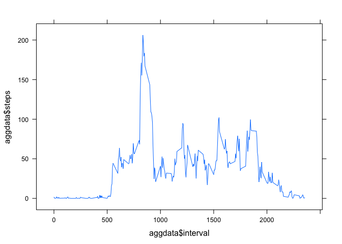
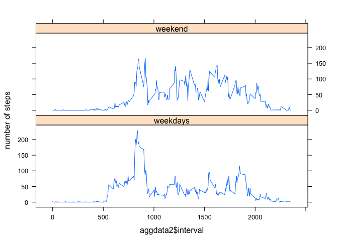

# Reproducible Research: Peer Assessment 1

```r
library(lattice)
library(nnet)
```

## Loading and preprocessing the data

```r
temp <- tempfile()
download.file("https://d396qusza40orc.cloudfront.net/repdata%2Fdata%2Factivity.zip",temp,method="curl")
data <- read.csv(unz(temp, "activity.csv"), header=TRUE)
unlink(temp)
```
The required histogram of the number of steps is as follows: 

```r
stepsperday<-aggregate(steps ~ date, data, sum)
hist(stepsperday$steps)
```

 

## What is mean total number of steps taken per day?

```r
mean(stepsperday$steps, na.rm=TRUE)
```

```
## [1] 10766
```

```r
median(stepsperday$steps,na.rm=TRUE)
```

```
## [1] 10765
```
## What is the average daily activity pattern?
The "time series plot" of the 5-minute interval and the average number of steps taken, averaged across all days.  

```r
aggdata<-aggregate(steps ~ interval, data, mean)
xyplot(aggdata$steps~aggdata$interval,type="l")
```

 
  
The maximum value of steps is found at the interval 835: 

```r
index<-which.is.max(aggdata$steps)
aggdata[index,]
```

```
##     interval steps
## 104      835 206.2
```

## Imputing missing values
The number of complete cases is 15264; the cases with missing data is therefore 2304.
I create a new dataframe, for imputing the missing data. 

```r
dataNoNa<-data
a<-which(is.na(data$steps))
for (index in 1:length(a)) {
        lineaggr<-which(aggdata$interval==dataNoNa$interval[a[index]])
        dataNoNa$steps[a[index]]<-aggdata$steps[lineaggr]        
}
```
Now, the histogram, mean and median of steps are the following: 

```r
stepsperday2<-aggregate(steps ~ date, dataNoNa, sum)
hist(stepsperday2$steps)
```

 

```r
mean(stepsperday2$steps, na.rm=TRUE)
```

```
## [1] 10766
```

```r
median(stepsperday2$steps,na.rm=TRUE)
```

```
## [1] 10766
```
The impact of imputing the missing data on these measures is very small; only the median is changed, and only slightly. 
## Are there differences in activity patterns between weekdays and weekends?
A new factor variable is created, indicating whether it is the weekend or not. 

```r
dates<-as.Date.factor(dataNoNa$date)
weekdays<-weekdays(dates)
weekend<-which(weekdays=="Samedi"|weekdays=="Dimanche") ##These are in French automatically; I have not fought this battle. 
week<-which(weekdays!="Samedi"&weekdays!="Dimanche")
dataNoNa$weekornot<-c(dataNoNa$date)
dataNoNa$weekornot[week]<-0
dataNoNa$weekornot[weekend]<-1
dataNoNa$weekornot<-factor(dataNoNa$weekornot,levels=c(0,1),labels<-c("weekdays","weekend"))
```
Now, the plot is created. 

```r
aggdata2<-aggregate(dataNoNa$steps,list(interval=dataNoNa$interval,weekornot=dataNoNa$weekornot), mean)
xyplot(aggdata2$x~aggdata2$interval|aggdata2$weekornot,type="l",ylab="number of steps",layout=c(1,2))
```

 


